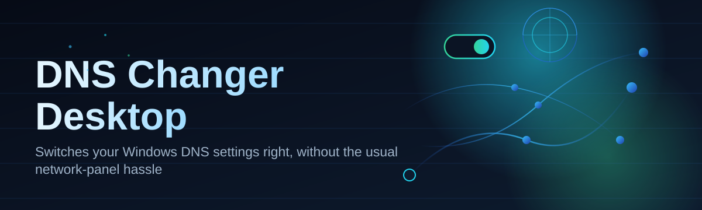
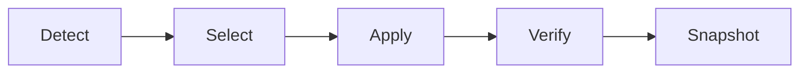

# dns-changer-configurator 🌐⚡

  

*Point-and-click DNS switching for Windows — no terminal, no registry archaeology, just faster and safer name resolution.*

---

## 🧭 Overview

**dns-changer-configurator** is a lightweight Windows desktop companion that turns the fiddly, multi-click process of changing your network's DNS servers into a single, guided action. Instead of digging through *Network and Sharing Center*, hunting for adapter properties, and typing IPv4 addresses by hand, you get a clean interface that lists trusted DNS providers, your saved custom profiles, and the current adapter status — all in one window.

The project exists because DNS configuration is one of those tasks Windows makes disproportionately tedious relative to how often people actually need it. Switching between your ISP's default resolver, a privacy-focused provider, or a low-latency public DNS server shouldn't require six dialog boxes and a reboot every time. DNS Changer Desktop treats DNS switching the way it should be treated in 2026: fast, visual, reversible, and safe for people who aren't networking engineers.

It's built for a wide range of users — gamers chasing lower ping to game servers, remote workers routing around a flaky ISP resolver, privacy-conscious folks who want encrypted DNS providers on rotation, and IT-adjacent tinkerers who manage DNS across several machines and want a repeatable, exportable profile instead of memorizing IP addresses. If you've ever typed `8.8.8.8` into an adapter properties box from memory, this tool is for you.

> [!NOTE]
> DNS Changer Desktop only changes DNS resolver settings on the network adapters you select. It does not modify your IP address, VPN configuration, or routing tables.

  

---

## 🎛️ What's Under the Hood

Rather than a bullet dump, here's the capability matrix — each row is a distinct reason people keep this tool pinned to their taskbar.

| Capability | What it actually does for you |
|---|---|
| **One-click provider switching** | Swap between Cloudflare, Google, Quad9, OpenDNS, or your ISP default without opening adapter properties. |
| **Custom DNS profiles** | Save your own primary/secondary pairs — home lab resolvers, work VPN DNS, or a personal favorite — and recall them instantly. |
| **Adapter-aware targeting** | Detects every active network adapter (Wi-Fi, Ethernet, virtual) so you apply changes to the *right* interface, not a random one. |
| **Instant rollback** | A single "Restore Previous" action reverts to whatever DNS configuration was active before your last change. |
| **Live connectivity check** | Pings the selected resolver right after applying it, confirming resolution actually works before you close the window. |
| **Export & import profiles** | Move your saved DNS setups between machines as a small config file — handy for reinstalling Windows or setting up a second PC. |
| **IPv4 & IPv6 support** | Configure dual-stack DNS entries side by side instead of juggling two separate settings screens. |
| **No background service** | Runs only when you open it — no persistent process quietly listening on your system. |

> [!TIP]
> Not sure which resolver is fastest for you? Use the built-in latency check to ping several providers back-to-back before committing.

---

## 🚀 Getting Started in Four Steps

1. **Visit the landing page** using the download button above — this is the only official source for the app.

2. **Download the Windows build** and save it anywhere convenient (Desktop, Downloads, wherever you'll remember).

3. **Run the executable.** No install wizard, no background service registration — it opens straight into the main window.

4. **Pick an adapter, pick a DNS profile, hit Apply.** The status panel confirms the change and runs a quick resolution test.

> [!IMPORTANT]
> Applying DNS changes to a network adapter requires administrator privileges on Windows. If the app requests elevation, that's expected behavior, not a red flag.

---

## 🖥️ System Requirements

| Requirement | Detail |
|---|---|
| **OS** | Windows 10 (64-bit) or Windows 11 |
| **Dependencies** | None — fully standalone, no runtime to install separately |
| **Disk space** | Under 50 MB |
| **RAM** | Negligible; runs comfortably alongside anything else you're doing |
| **Permissions** | Administrator rights needed only when applying adapter changes |
| **Internet** | Required only for the connectivity check, not for launching the app |

  

---

## 🔩 How It Works

The workflow behind DNS Changer Desktop is intentionally short — fewer moving parts means fewer things that can go wrong on your network stack.

1. **Detect** — the app enumerates active network adapters on launch.
2. **Select** — you choose an adapter and a DNS profile (built-in or custom).
3. **Apply** — the tool writes the new DNS entries to that adapter's configuration.
4. **Verify** — a lightweight resolution test confirms the new DNS is actually answering queries.
5. **Snapshot** — the previous configuration is stored locally in case you want to roll back.

> [!WARNING]
> If your machine uses a VPN client that manages its own DNS, changes made here may be overridden while the VPN is connected. Disconnect the VPN first if you want the new DNS to actually take effect.

---

## 🛟 Troubleshooting

<strong>My DNS change doesn't seem to apply — websites still resolve using the old servers.</strong>

Flush your DNS cache after applying a change (`ipconfig /flushdns` in a terminal), and check whether a VPN or router-level DNS override is silently taking priority.

<strong>The app asks for administrator permission every time I open it. Is that normal?</strong>

Yes — modifying adapter-level DNS settings is a privileged operation in Windows, so the elevation prompt is expected and by design.

<strong>I applied a custom profile and now nothing resolves at all.</strong>

Use the **Restore Previous** action to roll back instantly, then double-check the IP addresses in your custom profile for typos — a single wrong digit is the most common cause.

<strong>Can I set different DNS servers for Wi-Fi and Ethernet at the same time?</strong>

Yes. Adapter targeting is independent, so each network interface can carry its own DNS profile simultaneously.

<strong>Does this tool work on a corporate or managed laptop?</strong>

If Group Policy enforces DNS settings on that machine, applied changes may be reverted automatically by the policy — that's expected behavior of managed environments, not a bug in the app.

<strong>My connectivity check fails right after switching providers.</strong>

Give it a few seconds — some resolvers take a brief moment to become reachable after a switch, especially over Wi-Fi with a slower handshake.

---

## 🎨 UI, UX & Shortcuts

The interface leans minimal on purpose — dense enough for power users, calm enough for a first-time visitor.

| Shortcut | Action |
|---|---|
| `Ctrl + N` | Create a new custom DNS profile |
| `Ctrl + S` | Save current profile |
| `Ctrl + R` | Restore previous DNS configuration |
| `Ctrl + T` | Run connectivity/latency test |
| `Ctrl + E` | Export all profiles |
| `Ctrl + I` | Import a profile file |
| `F5` | Refresh adapter list |
| `Esc` | Close active dialog |

- Light and dark themes, switchable from Settings, follow your Windows theme by default.

- A compact "mini mode" shrinks the window to a small always-on-top status widget.

- Profile list supports drag-to-reorder, so your most-used resolver sits at the top.

> [!TIP]
> Pin your favorite provider to the top of the list from the right-click context menu — it becomes the default one-click target.

---

## 🤝 Contributing & Community

Bug reports, feature ideas, and pull requests are genuinely welcome — this project grows better with more eyes on real-world DNS quirks across different ISPs and routers.

> Open an issue describing your environment (Windows build, adapter type, ISP if relevant) — DNS behavior is notoriously environment-dependent, and details help a lot.

- Fork the repository and branch from `main` for any change.

- Keep pull requests focused — one feature or fix per PR is easier to review and merge.

- Discussion threads are open for feature requests before you invest time coding them.

---

## 📄 License

Released under the [MIT License](LICENSE), 2026. Use it, modify it, redistribute it — just keep the license notice intact.

---

## ⚖️ Disclaimer

DNS Changer Desktop is provided as-is, without warranty of any kind. Changing DNS settings affects how your device resolves domain names on the network — misconfigured entries can temporarily disrupt internet connectivity on the affected adapter. Always note your original DNS settings (or rely on the built-in snapshot/restore feature) before experimenting with new providers. This tool is intended for personal network configuration on devices you own or are authorized to manage.

  

